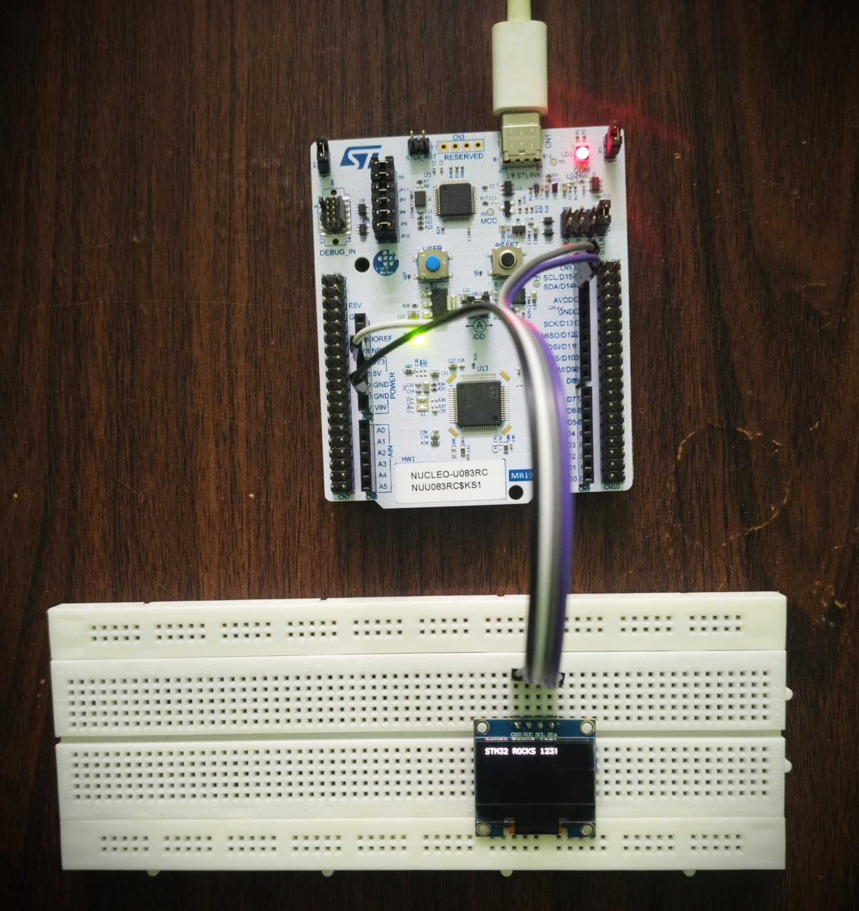
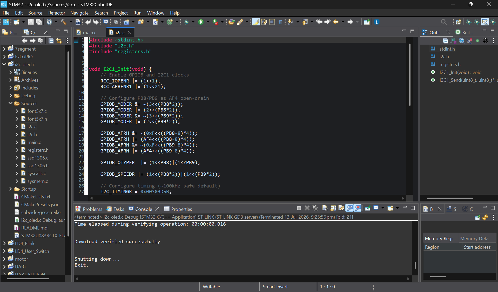

# I2C_SSD1306_OLED

## Overview

This project demonstrates a **modular register-level I²C and SSD1306 OLED driver implementation** on the **STM32 NUCLEO-U083RC** development board.

The firmware directly configures the **I2C1 peripheral** and communicates with a **128×64 SSD1306 OLED display**.

A custom **5×7 font table** is used to convert printable ASCII characters into display pixel data for character and string rendering.

All peripherals are configured using **direct register programming** without using the STM32 HAL library.

> **This project demonstrates the development of a custom I²C master transmit driver and its integration with an SSD1306 OLED display driver.**

---

## Hardware Used

- STM32 NUCLEO-U083RC
- SSD1306 128×64 I²C OLED Display
- Breadboard
- Jumper Wires
- USB Type-C Cable

---

## Features

- Register-Level Programming
- Modular Driver Architecture
- Centralized Register Definitions
- I2C1 Peripheral Initialization
- I²C Master Transmit
- I²C Slave Address Configuration
- I²C Transfer Byte Count Configuration
- START Condition Generation
- STOP Condition Generation
- BUSY Flag Handling
- TXIS Flag Handling
- NACKF Error Detection
- TC Transfer Complete Handling
- SSD1306 Initialization
- SSD1306 Command Transmission
- SSD1306 Display Data Transmission
- OLED Screen Clear
- Cursor Positioning
- 5×7 Font Table
- Printable ASCII Character Support
- Character Rendering
- String Rendering

---

# Project Images

## Hardware Setup



---

## STM32CubeIDE Project Structure



---

# I²C Configuration

| Configuration | Value |
|---------------|-------|
| I²C Peripheral | I2C1 |
| SCL Pin | PB8 |
| SDA Pin | PB9 |
| GPIO Alternate Function | AF4 |
| GPIO Output Type | Open-Drain |
| OLED I²C Address | `0x3C` |
| I²C Timing Register | `0x00303D5B` |

---

# Hardware Connections

## SSD1306 OLED

| SSD1306 Pin | STM32 Connection | Function |
|-------------|------------------|----------|
| VCC | 3.3V | OLED Power |
| GND | GND | Common Ground |
| SCL | PB8 | I2C1 Clock |
| SDA | PB9 | I2C1 Data |

---

# I²C Driver Operation

The custom `I2C1_Send()` function performs a complete I²C master transmission.

The transfer sequence is:

```text
Check BUSY Flag
        ↓
Configure Slave Address
        ↓
Select Write Direction
        ↓
Configure NBYTES
        ↓
Generate START Condition
        ↓
Wait for TXIS or NACKF
        ↓
Transmit Data Bytes
        ↓
Wait for TC Flag
        ↓
Generate STOP Condition
```

The I²C peripheral automatically tracks the number of transmitted bytes using the **NBYTES field** in the `I2C_CR2` register.

When the configured number of bytes has been transmitted, the hardware sets the **TC (Transfer Complete)** flag.

---

# SSD1306 Driver Operation

The SSD1306 driver is built on top of the custom I²C driver.

The OLED uses a control byte to identify the type of data being transmitted.

| Control Byte | Function |
|--------------|----------|
| `0x00` | SSD1306 Command |
| `0x40` | Display Data |

The display driver supports:

- OLED Initialization
- Display Clear
- Cursor Positioning
- Character Rendering
- String Rendering

---

# Font Rendering

The project uses a **5×7 font table** containing printable ASCII characters from:

```text
ASCII 32 (' ')
to
ASCII 126 ('~')
```

Each character is represented using **5 bytes**.

Each byte controls one vertical OLED display column.

The character rendering sequence is:

```text
Character
    ↓
ASCII Value
    ↓
ASCII Value - 32
    ↓
Font Table Index
    ↓
5-Byte Character Bitmap
    ↓
SSD1306 Display Data
    ↓
Character Displayed
```

One additional blank display column is transmitted after each character to provide spacing between characters.

Therefore, each character occupies:

```text
5 Pixel Columns
+
1 Spacing Column
=
6 Columns
```

---

# Project Structure

```text
I2C_SSD1306_OLED
├── Images/
│   ├── hardware_setup.jpg
│   └── cubeide_project.png
│
├── README.md
│
└── I2C_OLED_Driver_Modular/
    ├── Sources/
    │   ├── main.c
    │   ├── registers.h
    │   ├── i2c.c
    │   ├── i2c.h
    │   ├── ssd1306.c
    │   ├── ssd1306.h
    │   ├── font5x7.c
    │   └── font5x7.h
    │
    └── Startup/
```

---

# Software Used

- STM32CubeIDE
- ARM GCC Toolchain
- Git
- GitHub

---

# Notes

- Implemented entirely using direct register programming.
- No STM32 HAL library used.
- I2C1 is configured manually using peripheral registers.
- PB8 and PB9 are configured for I2C1 AF4 operation.
- GPIO pins are configured as open-drain for I²C communication.
- SSD1306 communication uses the custom `I2C1_Send()` driver.
- The I²C transfer length is configured using the `NBYTES` field.
- I²C transmission status is monitored using `BUSY`, `TXIS`, `NACKF`, and `TC` flags.
- The SSD1306 uses `0x00` for command transmission and `0x40` for display data.
- The font driver supports printable ASCII characters from 32 to 126.
- Tested on the STM32 NUCLEO-U083RC development board.

---

# Future Improvements

- I²C Receive Driver
- Interrupt-Driven I²C Communication
- I²C Timeout and Error Recovery
- SSD1306 Frame Buffer
- Multi-Line Text Handling
- Automatic Text Wrapping
- Larger Font Support
- Graphics and Shape Drawing
- I²C EEPROM Driver
- Multiple I²C Slave Device Integration