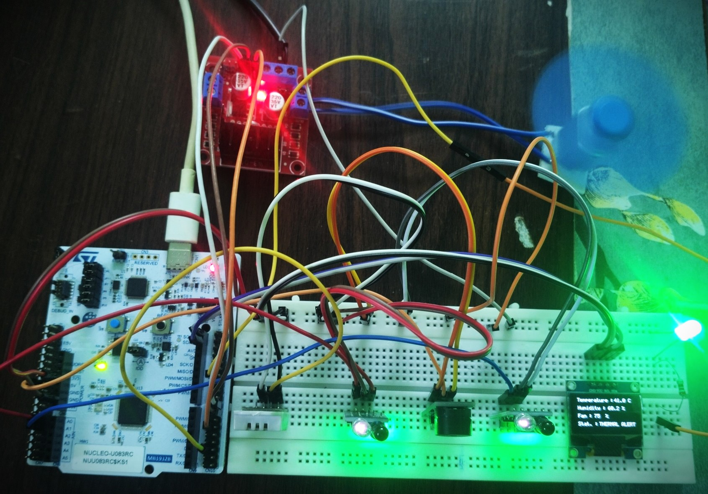
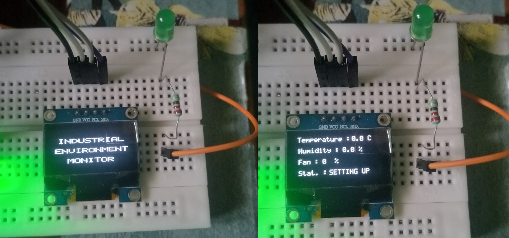
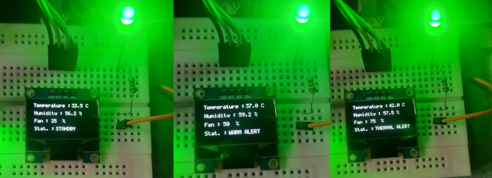

# Industrial Environment Monitor

A register-level embedded monitoring system built around the **STM32U083RC**. The system monitors temperature, humidity, and room occupancy, controls a fan and room-light output, and provides visual and audible alerts based on environmental conditions.

## Features

- 🌡️ **DHT22** temperature and humidity monitoring
- 👥 **IR-based occupancy detection** with entry/exit counting
- 🌀 **PWM fan control** based on temperature
- 💡 **Automatic room-light control** based on occupancy
- 🚨 **Thermal and occupancy alerts** using a buzzer
- 🖥️ **SSD1306 OLED** for real-time system status
- 🔄 **Finite State Machine (FSM)** for temperature management
- ⏱️ **SysTick and hardware timers** for timing and PWM
- ⚙️ **Register-level programming** — no HAL

## Operating Modes

| Temperature | Fan | Status |
|---|---:|---|
| `< 35°C` | 25% | Standby |
| `35–39.9°C` | 50% | Warm Alert |
| `≥ 40°C` | 75% | Thermal Alert |

The thermal alarm takes priority over the occupancy warning.

## Hardware

- STM32U083RC Nucleo board
- DHT22 temperature/humidity sensor
- 2 × IR sensors
- SSD1306 I²C OLED
- L298N motor driver
- DC motor as fan demonstration
- Buzzer
- Green LED for room-light indication

Industrial_Environment_Monitor/
├── Images/
│   ├── Hardware_Setup.jpg
│   ├── OLED_Splash.jpg
│   └── System_Operating_Modes.jpg
│
├── V1/
│   ├── Sources/
│   ├── Startup/
│   ├── .project
│   ├── .cproject
│   ├── CMakeLists.txt
│   ├── CMakePresets.json
│   ├── cubeide-gcc.cmake
│   ├── Industry_Monitor_Debug.launch
│   └── STM32U083RC_TX_FLASH.ld
│
└── README.md

## Hardware Setup

## OLED Interface

## V2 — Planned Enhancements

V2 will extend the monitoring system with:

- 🕒 **RTC** for timestamping events
- 🛢️ **MQ-2 gas sensor** for gas and smoke detection
- 💾 **EEPROM alert logging** to store alert events with timestamps
- 📋 Retrieval of stored alert information through UART for later analysis

## Development

**Target:** STM32U083RC  
**IDE:** STM32CubeIDE  
**Language:** C  
**Programming approach:** Bare-metal / Register-level programming  
**HAL:** Not used