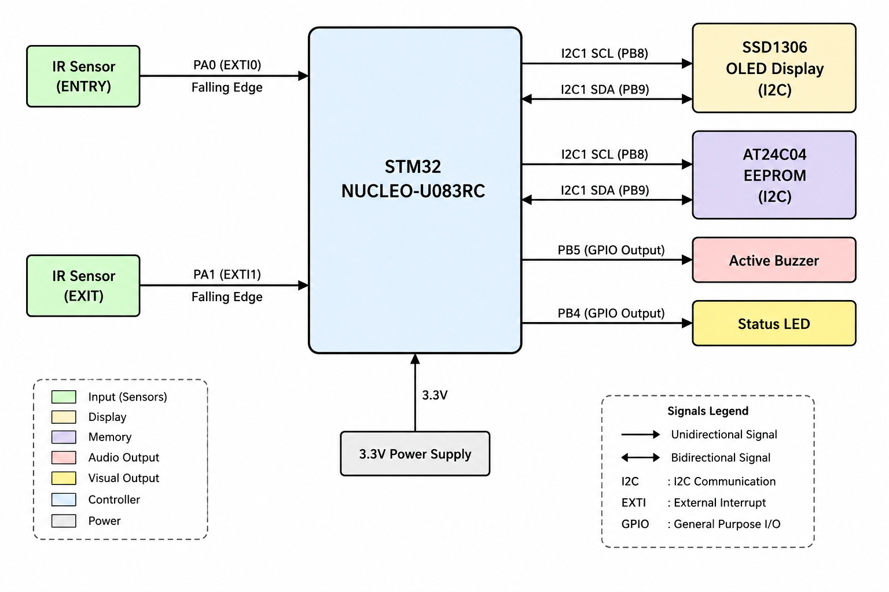
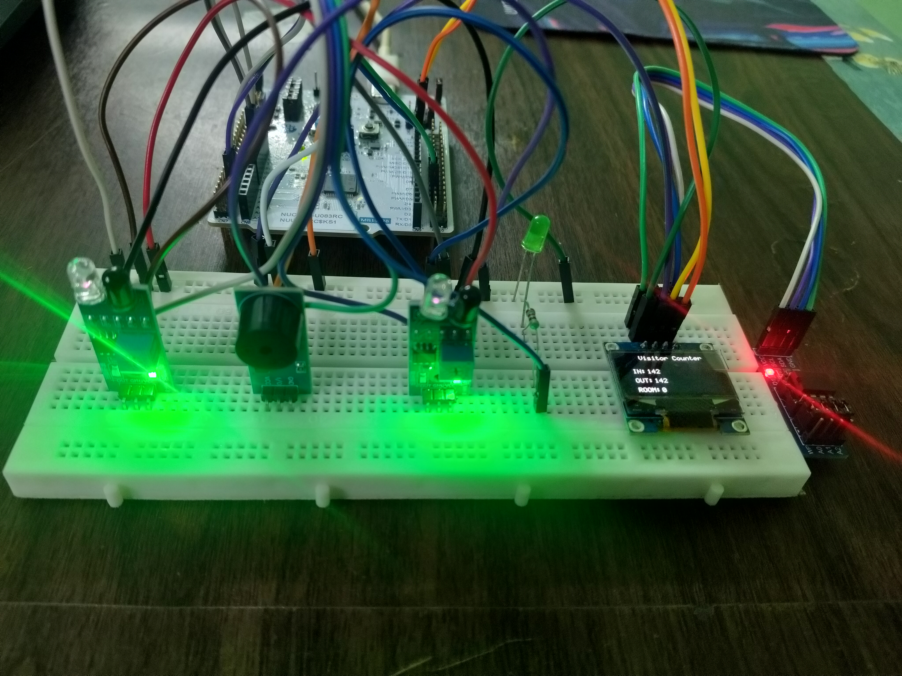
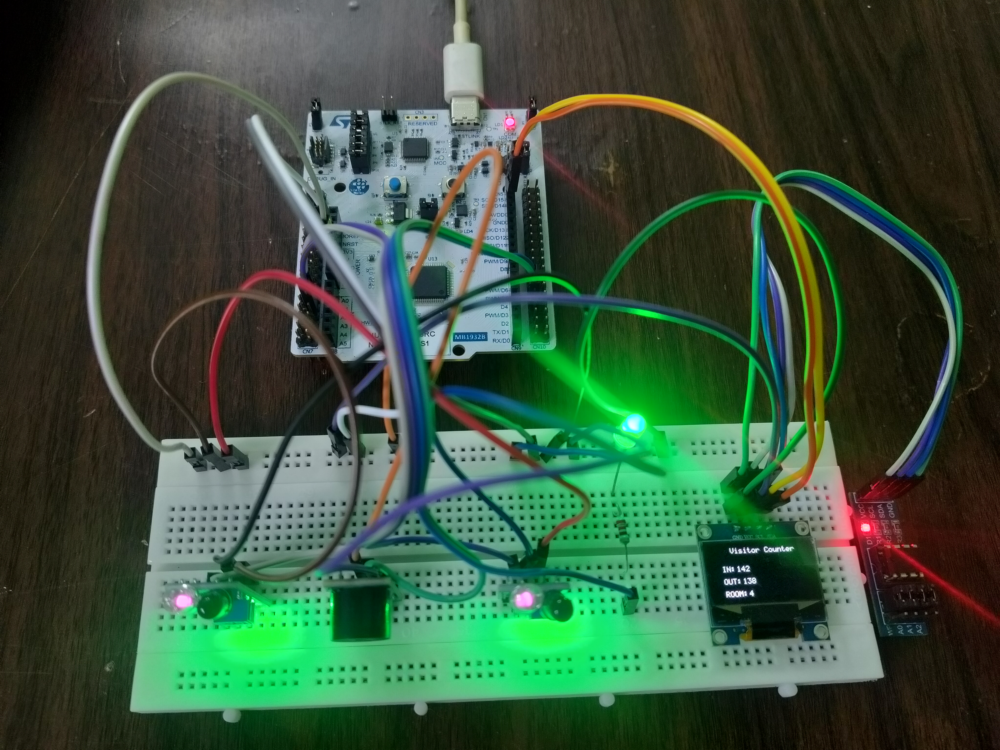
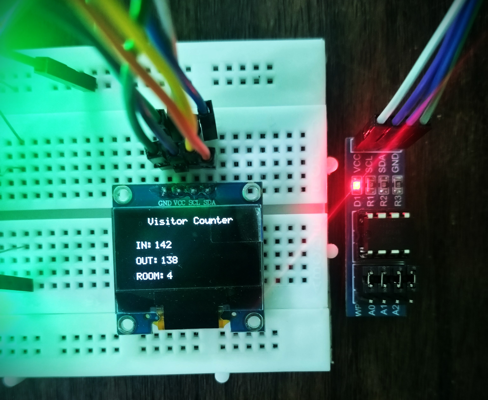

# STM32U083RC Visitor Counter

## Overview

This project implements a **register-level visitor counter system** on the **STM32 NUCLEO-U083RC** development board.

The system uses two IR sensors to detect **entry and exit events**. External interrupts are generated on falling-edge detection, and the visitor counts are displayed on a **128×64 SSD1306 OLED**.

The current visitor count is stored in an **AT24C04 I²C EEPROM** so that the count can be restored after a reset or power cycle.

An LED indicates room occupancy status, and an active buzzer provides audible feedback during visitor counting.

All peripherals are configured using **direct register programming** without using the STM32 HAL library.

> **This project demonstrates register-level STM32 firmware development by integrating GPIO, EXTI, SysTick, I²C, SSD1306 OLED, and EEPROM drivers into a complete visitor counter application.**

---

# Version

**Current Version: v1.0**

## Version 1.0

- Register-level STM32U083RC firmware
- Dual IR sensor visitor detection
- EXTI interrupt handling
- Software debounce
- SSD1306 OLED display
- AT24C04 EEPROM persistence
- Visitor entry and exit counting
- Room occupancy calculation
- Status LED indication
- Active buzzer feedback
- Modular peripheral drivers

## Version 2.0 — Planned

Version 2.0 will refactor the visitor counter application using a **Finite State Machine (FSM)** architecture.

Planned improvements include:

- FSM-based visitor detection
- Cleaner event and state handling
- Improved application architecture
- Separation of driver and application layers
- Improved project structure
- Detailed hardware interface documentation

---

# Hardware Used

- STM32 NUCLEO-U083RC
- IR Obstacle Sensors ×2
- SSD1306 128×64 I²C OLED Display
- AT24C04 I²C EEPROM
- Active Buzzer
- LED
- Resistors
- Breadboard
- Jumper Wires
- USB Type-C Cable

---

# Features

- Register-Level Programming
- No STM32 HAL Library
- Modular Peripheral Drivers
- GPIO Configuration
- External Interrupt Configuration
- Falling-Edge EXTI Detection
- Software Debouncing
- 1 ms SysTick Time Base
- I²C1 Peripheral Initialization
- I²C Master Transmit
- I²C Write-Read Operation
- I²C Slave Address Configuration
- I²C BUSY Flag Handling
- I²C TXIS Flag Handling
- I²C RXNE Flag Handling
- I²C NACKF Error Detection
- I²C TC Transfer Complete Handling
- I²C STOPF Handling
- SSD1306 OLED Initialization
- SSD1306 Command Transmission
- SSD1306 Display Data Transmission
- OLED Screen Clear
- OLED Cursor Positioning
- 5×7 ASCII Font
- Character Rendering
- String Rendering
- Scaled Character Rendering
- EEPROM Byte Read/Write
- EEPROM 16-bit Data Read/Write
- EEPROM Write-Cycle Polling
- Persistent Visitor Count
- Entry Count
- Exit Count
- Current Occupancy Count
- LED Status Indication
- Buzzer Feedback

---

# Project Images

## System Block Diagram



## Hardware Setup





## OLED Splash Screen


## Visitor Counter Display



---

# System Operation

The visitor counter uses two IR sensors:

- **IR Entry Sensor** detects visitors entering the room.
- **IR Exit Sensor** detects visitors leaving the room.

Each sensor is connected to an EXTI input and configured for falling-edge detection.

The basic operation is:

```text
IR Entry Sensor
       ↓
    EXTI0
       ↓
   InFlag = 1
       ↓
   Entry Count++
       ↓
   Present++


IR Exit Sensor
       ↓
    EXTI1
       ↓
   OutFlag = 1
       ↓
   Exit Count++
       ↓
   Present--
```

The OLED displays:

```text
Visitor Counter

IN:   Entry Count
OUT:  Exit Count
ROOM: Current Occupancy
```

---

# GPIO Configuration

| Peripheral | Pin | Function |
| ---------- | --- | -------- |
| IR Entry Sensor | PA0 | EXTI0 Input |
| IR Exit Sensor | PA1 | EXTI1 Input |
| Status LED | PB4 | GPIO Output |
| Active Buzzer | PB5 | GPIO Output |
| I²C SCL | PB8 | I2C1 SCL |
| I²C SDA | PB9 | I2C1 SDA |

---

# EXTI Configuration

| Configuration | Value |
| ------------- | ----- |
| Entry Sensor | PA0 |
| Exit Sensor | PA1 |
| Entry Interrupt | EXTI0 |
| Exit Interrupt | EXTI1 |
| Trigger | Falling Edge |
| NVIC IRQ | `EXTI0_1_IRQn` |
| Debounce Time | `150 ms` |

The EXTI interrupt handler sets event flags instead of performing the visitor-counting logic directly.

```text
IR Sensor
    ↓
Falling Edge
    ↓
EXTI Interrupt
    ↓
Debounce Check
    ↓
Set InFlag / OutFlag
    ↓
Main Application
    ↓
Update Visitor Counts
```

---

# SysTick Configuration

SysTick provides the system millisecond time base used by the application and interrupt debounce logic.

| Configuration | Value |
| ------------- | ----- |
| System Clock | 4 MHz |
| SysTick Period | 1 ms |
| Reload Value | `3999` |
| Time Counter | `SysTick_ms` |

The SysTick interrupt increments the global millisecond counter:

```text
SysTick Interrupt
        ↓
   SysTick_ms++
```

The counter is also used for software debounce timing and millisecond delays.

---

# I²C Configuration

| Configuration | Value |
| ------------- | ----- |
| I²C Peripheral | I2C1 |
| SCL Pin | PB8 |
| SDA Pin | PB9 |
| GPIO Alternate Function | AF4 |
| GPIO Output Type | Open-Drain |
| I²C Timing Register | `0x00303D5B` |
| OLED I²C Address | `0x3C` |

Both the SSD1306 OLED and AT24C04 EEPROM communicate with the STM32 through the same I²C1 peripheral.

```text
                    +----------------+
                    |     STM32      |
                    |     I2C1       |
                    +-------+--------+
                            |
                  +---------+---------+
                  |                   |
                 SCL                 SDA
                  |                   |
          +-------+-------+   +-------+-------+
          |               |   |               |
          ▼               ▼   ▼               ▼
      SSD1306 OLED              AT24C04 EEPROM
```

---

# SSD1306 OLED

The SSD1306 driver provides:

- OLED Initialization
- Display Clear
- Cursor Positioning
- Character Rendering
- String Rendering
- Scaled Character Rendering

The OLED uses the following control bytes:

| Control Byte | Function |
| ------------ | -------- |
| `0x00` | SSD1306 Command |
| `0x40` | Display Data |

---

# Font Rendering

The project uses a **5×7 font table** containing printable ASCII characters from:

```text
ASCII 32 (' ')
to
ASCII 126 ('~')
```

Each character is represented using five bytes.

The character rendering sequence is:

```text
Character
    ↓
ASCII Value
    ↓
ASCII Value - 32
    ↓
Font Table Index
    ↓
5-Byte Character Bitmap
    ↓
SSD1306 Display Data
    ↓
Character Displayed
```

A blank column is transmitted after each character to provide spacing.

```text
5 Pixel Columns
       +
1 Spacing Column
       =
6 Columns per Character
```

---

# EEPROM Persistence

The AT24C04 EEPROM is used to store visitor count data.

The driver supports:

- Byte Write
- Byte Read
- 16-bit Value Write
- 16-bit Value Read
- EEPROM Write-Cycle Polling

The visitor count can therefore be restored from EEPROM after reset or power cycling.

The 16-bit data format is stored as:

```text
16-bit Value

+----------------+----------------+
|   High Byte    |    Low Byte    |
+----------------+----------------+
       8 bits          8 bits
```

The EEPROM driver waits for the device to complete its internal write cycle before continuing.

---

# Visitor Counting

The application maintains three values:

```text
InCount
OutCount
Present
```

The occupancy is based on entry and exit events:

```text
Entry Event
    ↓
InCount++
Present++


Exit Event
    ↓
OutCount++
Present--
```

The OLED displays all three values.

---

# LED Indication

The status LED is connected to **PB4**.

The LED is controlled using direct GPIO register access.

```text
Room Occupancy
      ↓
Application Logic
      ↓
PB4 GPIO
      ↓
Status LED
```

---

# Buzzer

An active buzzer is connected to **PB5**.

The buzzer provides audible feedback when triggered by the application.

```text
Visitor Event
      ↓
Buzzer_Beep()
      ↓
PB5
      ↓
Active Buzzer
```

The current implementation generates a **500 ms beep**.

---

# I²C Driver Operation

The custom `I2C1_Send()` function performs a complete I²C master transmission.

The transfer sequence is:

```text
Check BUSY Flag
        ↓
Configure Slave Address
        ↓
Select Write Direction
        ↓
Configure NBYTES
        ↓
Generate START Condition
        ↓
Wait for TXIS or NACKF
        ↓
Transmit Data Bytes
        ↓
Wait for TC Flag
        ↓
Generate STOP Condition
        ↓
Clear STOPF
```

The `I2C1_WriteRead()` function performs a write followed by a repeated START and read operation:

```text
Check BUSY Flag
        ↓
Configure Slave Address
        ↓
Configure Write Transfer
        ↓
Generate START
        ↓
Transmit Data
        ↓
Wait for TC
        ↓
Configure Read Transfer
        ↓
Generate Repeated START
        ↓
Receive Data
        ↓
Wait for TC
        ↓
Generate STOP
        ↓
Clear STOPF
```

Timeout handling is implemented to prevent the firmware from remaining indefinitely inside communication loops.

---

# Project Structure

```text
Visitor-Counter-STM32U083RC
│
├── Images/
│   ├── Block_Diagram.png
│   ├── Hardware_Setup_front_view.jpg
│   ├── Hardware_Setup_top_view.jpg
│   ├── OLED_Splash.jpg
│   └── OLED_Count.jpg
│
├── README.md
│
├── CMakeLists.txt
│
├── Startup/
│   └── startup_stm32u083rctx.s
│
└── Sources/
    ├── main.c
    ├── gpio.c
    ├── gpio.h
    ├── SysTick.c
    ├── SysTick.h
    ├── EXTI.c
    ├── EXTI.h
    ├── i2c.c
    ├── i2c.h
    ├── ssd1306.c
    ├── ssd1306.h
    ├── font5x7.c
    ├── font5x7.h
    ├── EEPROM.c
    ├── EEPROM.h
    ├── display.c
    └── display.h
```

---

# Software Used

- STM32CubeIDE
- ARM GCC Toolchain
- C
- Git
- GitHub

---

# Development Approach

The project was implemented using **direct register programming** on the STM32U083RC.

The following peripherals and interfaces were configured without STM32 HAL:

```text
GPIO
 ↓
SysTick
 ↓
EXTI
 ↓
I²C
 ↓
SSD1306 OLED
 ↓
AT24C04 EEPROM
 ↓
Visitor Counter Application
```

The firmware uses separate modules for peripheral functionality and higher-level display functionality.

---

# Version History

## v1.0 — Initial Release

- Completed working visitor counter
- Register-level peripheral configuration
- IR-based entry and exit detection
- EXTI interrupt handling
- Software debounce
- SSD1306 OLED interface
- AT24C04 EEPROM persistence
- Visitor count tracking
- Room occupancy display
- LED indication
- Buzzer feedback
- Initial project documentation

## v2.0 — Planned FSM Refactor

The next version will introduce a **Finite State Machine (FSM)** for visitor detection and application control.

Planned architecture:

```text
Sensor Events
     ↓
   FSM
     ↓
State Transition
     ↓
Application Action
     ↓
Display / EEPROM / Outputs
```

The v2.0 development will also improve the separation between **hardware drivers** and **application logic**, along with a more detailed hardware interface diagram.

---

# Future Improvements

- Finite State Machine based application
- Improved application architecture
- Driver/Application directory separation
- Detailed hardware interface diagram
- Improved sensor event handling
- More robust visitor detection sequence
- Additional display functionality
- Further EEPROM data management
- Additional application features

---

# Notes

- Implemented entirely using direct register programming.
- No STM32 HAL library is used.
- Target MCU: STM32U083RC.
- IR sensors use falling-edge EXTI interrupts.
- Software debounce is implemented using the SysTick millisecond counter.
- SSD1306 OLED communicates through I2C1.
- AT24C04 EEPROM communicates through I2C1.
- PB8 and PB9 are used for I²C communication.
- Visitor counts are stored as 16-bit values.
- The project was tested on the STM32 NUCLEO-U083RC development board.