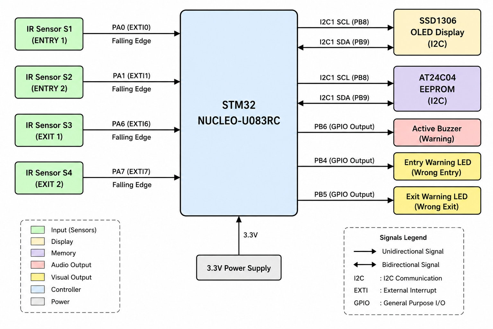
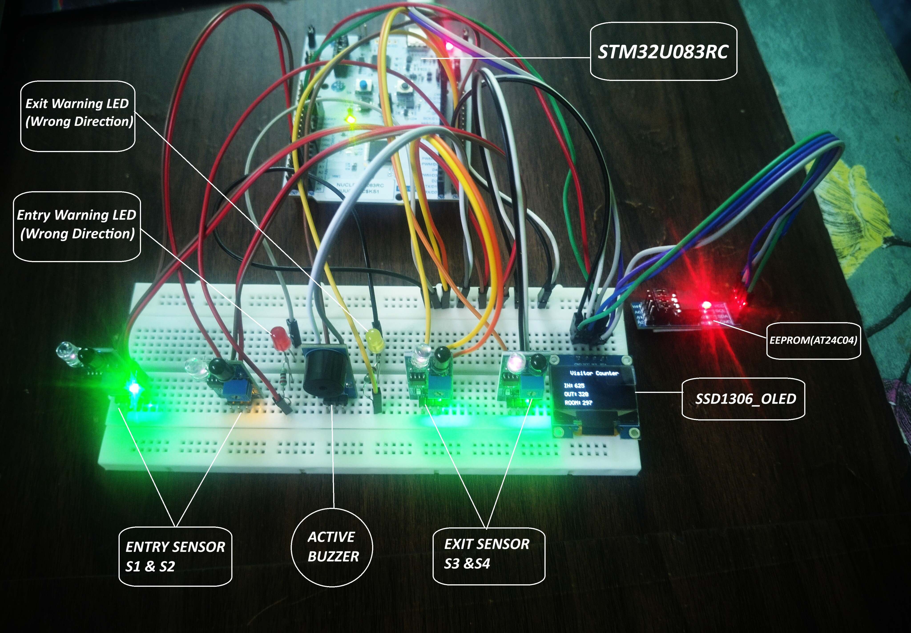
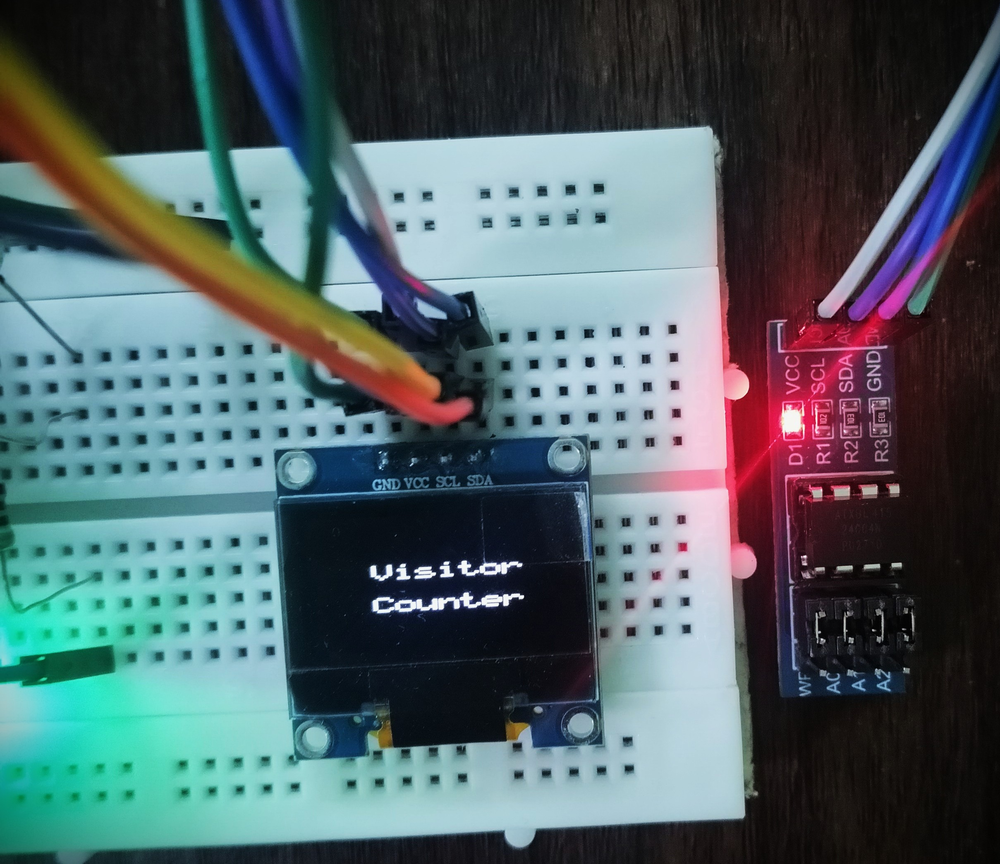
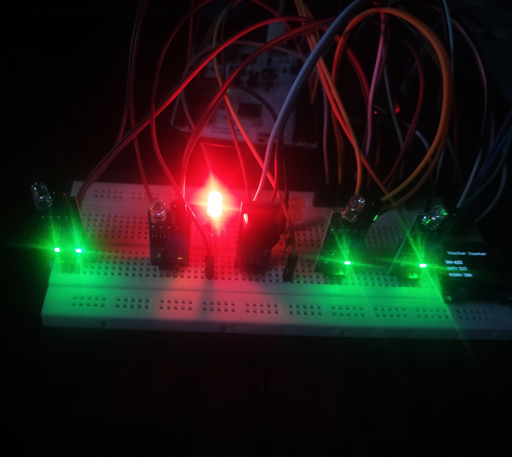
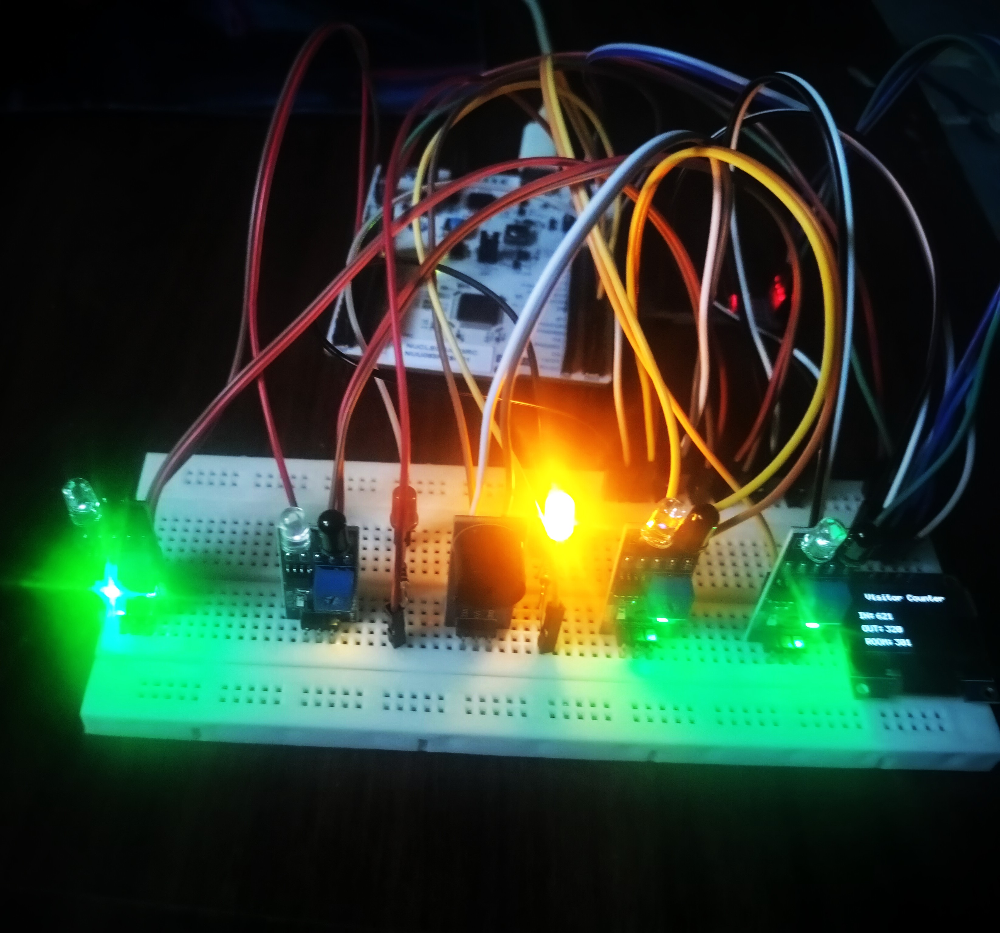

# STM32U083RC Visitor Counter — V2

A register-level embedded visitor counter built using the STM32U083RC, four IR sensors, an SSD1306 OLED, AT24C04 EEPROM, warning LEDs, and an active buzzer.

V2 introduces a Finite State Machine (FSM) to determine visitor movement direction from the order of sensor triggers.

## System Block Diagram

  

## Hardware Setup

  

## OLED Count Display

  

## OLED Splash Screen

  

## Entry Warning LED

  

## Exit Warning LED

  

## Features

- Four IR sensors for entry and exit detection
- EXTI falling-edge interrupts
- Per-sensor debounce
- Sensor re-arm mechanism
- FSM-based direction detection
- Valid entry and exit counting
- Wrong-direction detection
- SSD1306 128×64 I²C OLED
- AT24C04 EEPROM persistent storage
- Entry and exit warning LEDs
- Active buzzer
- 1 ms SysTick time base
- Direct register-level programming
- Modular embedded C drivers
- No STM32 HAL

## V1 → V2

| V1 | V2 |
|---|---|
| Basic visitor counting | FSM-based direction detection |
| Basic sensor events | Sensor sequence validation |
| Basic indication | Wrong-direction warnings |
| Basic sensor handling | Debounce + sensor re-arm |
| OLED + EEPROM | OLED + EEPROM + warning system |

## Hardware

- STM32U083RC
- IR obstacle sensors ×4
- SSD1306 128×64 I²C OLED
- AT24C04 EEPROM
- Active buzzer
- Warning LEDs ×2
- 220 Ω resistors ×2

## Pin Configuration

| Function | STM32 Pin |
|---|---|
| Entry Sensor 1 — S1 | PA0 |
| Entry Sensor 2 — S2 | PA1 |
| Exit Sensor 1 — S3 | PA6 |
| Exit Sensor 2 — S4 | PA7 |
| Entry Warning LED | PB4 |
| Exit Warning LED | PB5 |
| Buzzer | PB6 |
| I²C1 SCL | PB8 |
| I²C1 SDA | PB9 |

### Sensor Logic

The IR sensors use pull-up inputs.

    HIGH = Beam clear
    LOW  = Beam blocked

A HIGH → LOW transition generates a falling-edge EXTI event.

## Visitor Detection Logic

    S1 → S2 = Valid Entry

    S2 → S1 = Wrong Entry

    S3 → S4 = Valid Exit

    S4 → S3 = Wrong Exit

### Valid Entry

    S1 triggered
        ↓
    Wait for S2
        ↓
    S2 triggered
        ↓
    InCount++
    Present++
        ↓
    Save InCount to EEPROM
        ↓
    Update OLED
        ↓
    Return to FSM_IDLE

### Valid Exit

    S3 triggered
        ↓
    Wait for S4
        ↓
    S4 triggered
        ↓
    OutCount++
    Present--
        ↓
    Save OutCount to EEPROM
        ↓
    Update OLED
        ↓
    Return to FSM_IDLE

`Present` is protected from underflow during an exit.

## Finite State Machine

V2 uses five FSM states:

    FSM_IDLE
    FSM_ENTRY_S1
    FSM_ENTRY_S2
    FSM_EXIT_S3
    FSM_EXIT_S4

The state flow is:

    FSM_IDLE
        │
        ├── S1 → FSM_ENTRY_S1
        │           └── S2 → Valid Entry
        │
        ├── S2 → FSM_ENTRY_S2
        │           └── S1 → Wrong Entry
        │
        ├── S3 → FSM_EXIT_S3
        │           └── S4 → Valid Exit
        │
        └── S4 → FSM_EXIT_S4
                    └── S3 → Wrong Exit

An incomplete sensor sequence returns to `FSM_IDLE` after:

    FSM_TIMEOUT_MS = 2000 ms

## EXTI and Sensor Handling

Sensor connections:

    PA0 → EXTI0 → S1

    PA1 → EXTI1 → S2

    PA6 → EXTI6 → S3

    PA7 → EXTI7 → S4

Interrupt handlers:

    EXTI0_1_IRQHandler()
        ├── S1
        └── S2

    EXTI4_15_IRQHandler()
        ├── S3
        └── S4

The interrupt handlers set software flags:

    S1_Flag
    S2_Flag
    S3_Flag
    S4_Flag

The FSM processes these flags in normal application context.

### Debounce

Each sensor has independent debounce handling.

    DEBOUNCE_MS = 500 ms

After an event is accepted, the sensor is disarmed until its input returns HIGH.

This prevents repeated events while a sensor remains blocked.

## Warning System

Wrong-direction sequences activate the corresponding warning LED and buzzer.

    S2 → S1
        ↓
    Entry Warning LED + Buzzer

    S4 → S3
        ↓
    Exit Warning LED + Buzzer

Warning duration:

    WARNING_TIME_MS = 1000 ms

## EEPROM Persistence

The AT24C04 stores cumulative visitor counters in non-volatile memory.

    EEPROM_IN_COUNT_ADDR  = 0x0000

    EEPROM_OUT_COUNT_ADDR = 0x0004

At startup:

    InCount  ← EEPROM

    OutCount ← EEPROM

    Present = InCount - OutCount

For a valid entry:

    InCount++

    Present++

For a valid exit:

    OutCount++

    if (Present > 0)
        Present--

The EEPROM driver supports byte and 16-bit read/write operations and waits for the device to complete its internal write cycle.

## OLED Display

The SSD1306 OLED uses I²C1:

    PB8 → SCL

    PB9 → SDA

OLED address:

    0x3C

The display shows:

    Visitor Counter

    IN:   <entry count>

    OUT:  <exit count>

    ROOM: <occupancy>

The SSD1306 driver provides display initialization, clearing, cursor positioning, character rendering, string rendering, and scaled text rendering.

The ASCII 5×7 font table is stored separately in `font5x7.c`.

## I²C Devices

Both peripherals share the I²C1 bus.

| Device | Address |
|---|---|
| SSD1306 OLED | `0x3C` |
| AT24C04 EEPROM | `0x50` / `0x51` |

## SysTick

SysTick provides the 1 ms system time base.

The `SysTick_ms` counter is used for:

- Sensor debounce
- FSM timeout
- Warning timeout
- EEPROM timeout
- Blocking delays

The project uses a 4 MHz system clock with a SysTick reload value of `3999`.

## System Architecture

    IR Sensors
        ↓
    GPIO Inputs
        ↓
    EXTI Interrupts
        ↓
    Sensor Flags
        ↓
    FSM
        ↓
    ┌───────────────┬──────────────┐
    │               │              │
    Counters      Warnings        OLED
        │               │
        ↓               ├── LEDs
    EEPROM              └── Buzzer

Module responsibilities:

| Module | Responsibility |
|---|---|
| `main.c` | System initialization and main loop |
| `FSM.c/h` | Visitor movement and direction logic |
| `EXTI.c/h` | Sensor interrupts and re-arm handling |
| `gpio.c/h` | GPIO, LEDs and buzzer |
| `i2c.c/h` | I²C communication |
| `EEPROM.c/h` | AT24C04 storage |
| `ssd1306.c/h` | Low-level OLED driver |
| `display.c/h` | OLED application display |
| `font5x7.c/h` | ASCII font table |
| `SysTick.c/h` | 1 ms timing and delays |

## Main Loop

    while (1)
    {
        EXTI_Process();
        FSM_Process();
    }

`EXTI_Process()` handles sensor re-arm status.

`FSM_Process()` interprets sensor sequences and performs visitor counting or warning actions.

The interrupt handlers only capture hardware events and set flags, keeping longer application operations outside interrupt context.

## Project Structure

    Visitor_Counter_V2/
    ├── Images/
    │
    └── V2/
        ├── Sources/
        │   ├── display.c
        │   ├── display.h
        │   ├── EEPROM.c
        │   ├── EEPROM.h
        │   ├── EXTI.c
        │   ├── EXTI.h
        │   ├── font5x7.c
        │   ├── font5x7.h
        │   ├── FSM.c
        │   ├── FSM.h
        │   ├── gpio.c
        │   ├── gpio.h
        │   ├── i2c.c
        │   ├── i2c.h
        │   ├── main.c
        │   ├── ssd1306.c
        │   ├── ssd1306.h
        │   ├── SysTick.c
        │   └── SysTick.h
        │
        ├── Startup/
        ├── Debug/
        ├── .settings/
        ├── .project
        ├── .cproject
        ├── CMakeLists.txt
        ├── CMakePresets.json
        ├── cubeide-gcc.make
        ├── STM32U083RC_TX_FLASH.ld
        └── Visitor_Counter_Debug.launch

## Timing

| Parameter | Value | Purpose |
|---|---:|---|
| `DEBOUNCE_MS` | 500 ms | Sensor debounce |
| `FSM_TIMEOUT_MS` | 2000 ms | Sensor sequence timeout |
| `WARNING_TIME_MS` | 1000 ms | Warning duration |
| `EEPROM_TIMEOUT_MS` | 10 ms | EEPROM ready timeout |
| `SPLASH_SCREEN_TIME_MS` | 2000 ms | OLED splash |
| SysTick | 1 ms | System time base |

## Build and Run

### Requirements

- STM32CubeIDE
- STM32U083RC development board
- Visitor Counter V2 hardware

### Steps

1. Open the `V2` project in STM32CubeIDE.
2. Build the project.
3. Flash the firmware to the STM32U083RC.
4. Reset the board.
5. Verify the OLED startup screen.
6. Test the four sensor sequences.

### Startup Flow

    GPIO_Init()
        ↓
    SysTick_Init()
        ↓
    EXTI_Init()
        ↓
    I2C1_Init()
        ↓
    SSD1306_Init()
        ↓
    Read EEPROM Counters
        ↓
    Calculate Present
        ↓
    Show Splash Screen
        ↓
    Show Counter Layout
        ↓
    FSM_Init()
        ↓
    Main Loop

## Technical Concepts

- Embedded C
- STM32 register-level programming
- GPIO
- EXTI
- NVIC
- Finite State Machines
- Sensor debouncing
- Sensor re-arm logic
- SysTick timing
- I²C communication
- OLED interfacing
- EEPROM
- Non-volatile data storage
- Modular driver architecture
- Event-driven firmware
- Hardware/application separation

## Project Status

**Completed — Visitor Counter V2**

Implemented:

- Four-sensor movement detection
- Valid entry counting
- Valid exit counting
- Wrong-direction detection
- Sensor debounce
- Sensor re-arm
- FSM timeout
- EEPROM persistence
- OLED display
- Entry warning LED
- Exit warning LED
- Buzzer warning
- Room occupancy tracking

## Future Improvements

- UART command interface
- EEPROM wear management
- Maximum occupancy limit
- FreeRTOS implementation

## Author

**Balaji M**

Target: **STM32U083RC**

Project: **Visitor Counter V2**