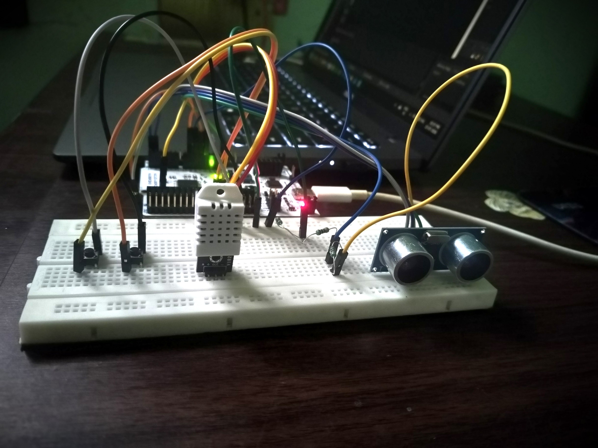
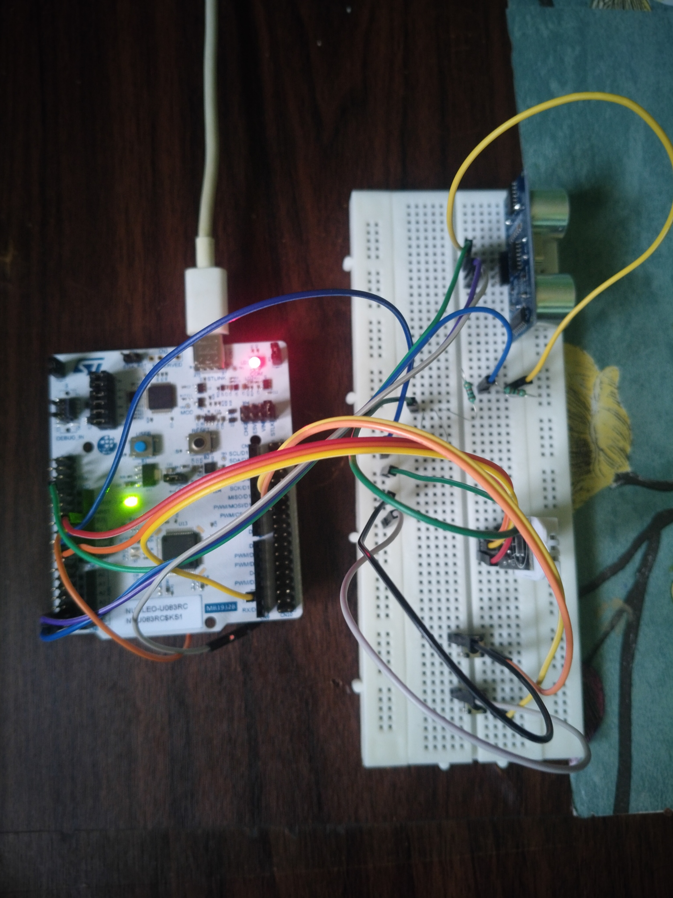
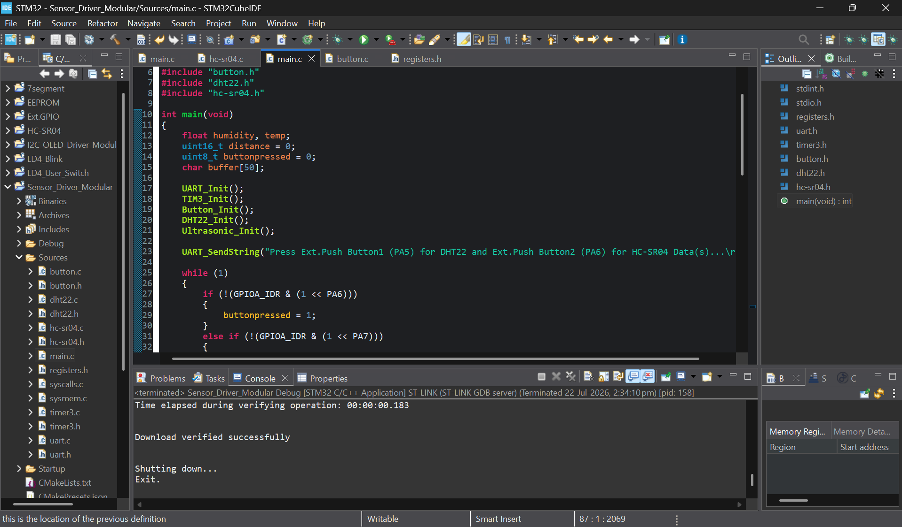
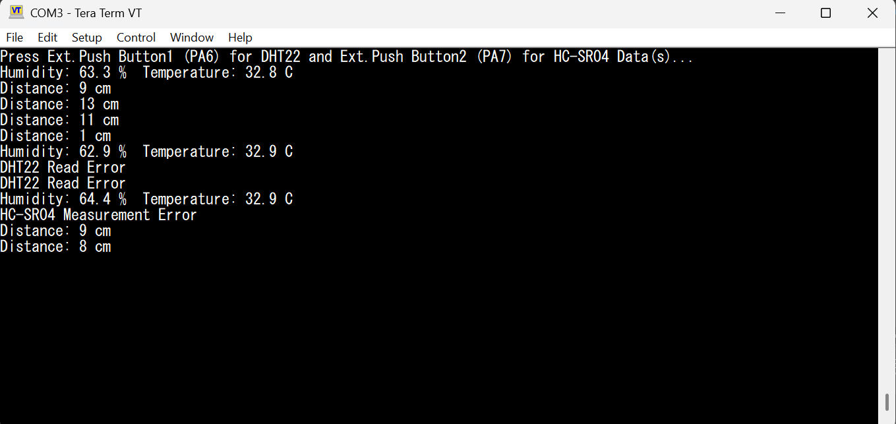

# STM32 Sensor Drivers

## Overview

This project demonstrates a **modular register-level sensor driver implementation** on the **STM32 NUCLEO-U083RC** development board.

The project includes custom drivers for the **DHT22 Temperature & Humidity Sensor** and the **HC-SR04 Ultrasonic Sensor**, along with reusable **UART**, **TIM3**, and **Push Button** drivers.

A generic **TIM3 microsecond delay driver** is shared between both sensor drivers to provide accurate timing required for sensor communication.

All peripherals are configured using **direct register programming** without using the STM32 HAL library.

> **This project demonstrates the development of reusable bare-metal peripheral drivers and custom sensor interfaces using modular register-level programming on the STM32U083RC.**

---

# Hardware Used

- STM32 NUCLEO-U083RC
- DHT22 (AM2302) Temperature & Humidity Sensor
- HC-SR04 Ultrasonic Sensor
- 2 Push Buttons
- Breadboard
- Jumper Wires
- USB Type-C Cable

---

# Features

- Register-Level Programming
- Modular Driver Architecture
- Centralized Register Definitions
- Generic TIM3 Microsecond Delay Driver
- USART2 UART Driver
- Push Button Driver
- DHT22 Single-Wire Communication Driver
- HC-SR04 Ultrasonic Driver
- GPIO Mode Switching
- Open-Drain GPIO Configuration
- Communication Timeout Handling
- DHT22 Checksum Validation
- Temperature Measurement
- Humidity Measurement
- Distance Measurement
- UART Sensor Data Output

---

# Project Images

## Hardware Setup (Side View)



---

## Hardware Setup (Top View)



---

## STM32CubeIDE Project Structure



---

## UART Output



---

# Peripheral Configuration

| Configuration | Value |
|---------------|-------|
| UART Peripheral | USART2 |
| Baud Rate | 115200 |
| Timer | TIM3 |
| Timer Resolution | 1 µs |
| Prescaler | 3 |
| Auto Reload Register | 65535 |
| DHT22 Data Pin | PA10 |
| HC-SR04 Trigger Pin | PC2 |
| HC-SR04 Echo Pin | PC3 |
| Button 1 | PA6 |
| Button 2 | PA7 |

---

# Hardware Connections

## DHT22

| DHT22 Pin | STM32 Connection | Function |
|------------|------------------|----------|
| VCC | 3.3V | Sensor Power |
| DATA | PA10 | Data Line |
| GND | GND | Common Ground |

---

## HC-SR04

| HC-SR04 Pin | STM32 Connection | Function |
|--------------|------------------|----------|
| VCC | 5V | Sensor Power |
| TRIG | PC2 | Trigger Pulse |
| ECHO | PC3 | Echo Pulse *(via voltage divider)* |
| GND | GND | Common Ground |

---

## Push Buttons

| Button | STM32 Connection |
|---------|------------------|
| Button 1 | PA6 |
| Button 2 | PA7 |

---

# Program Flow

```text
Initialize UART
        ↓
Initialize TIM3
        ↓
Initialize Buttons
        ↓
Initialize DHT22
        ↓
Initialize HC-SR04
        ↓
Wait for Button Press
        ↓
PA6 Pressed?
        │
       Yes
        │
Read Temperature & Humidity
        │
Transmit over UART
        │
Return to Main Loop
        │
        ▼
PA7 Pressed?
        │
       Yes
        │
Measure Distance
        │
Transmit over UART
        │
Return to Main Loop
```

---

# DHT22 Driver Operation

The custom `DHT22_Read()` function performs a complete DHT22 communication sequence.

```text
Generate Start Signal
        ↓
Wait for Sensor Response
        ↓
Read 40 Data Bits
        ↓
Store 5 Data Bytes
        ↓
Validate Checksum
        ↓
Convert Raw Humidity
        ↓
Convert Raw Temperature
        ↓
Return Measured Values
```

The received packet is validated using the checksum byte.

```text
Byte0 + Byte1 + Byte2 + Byte3
                ↓
Least Significant Byte
                ↓
Compare with Byte4
```

If the checksum matches, the measured humidity and temperature are returned.

---

# DHT22 Data Format

The DHT22 transmits **40 bits** of data.

| Byte | Description |
|------|-------------|
| Byte 0 | Humidity High Byte |
| Byte 1 | Humidity Low Byte |
| Byte 2 | Temperature High Byte |
| Byte 3 | Temperature Low Byte |
| Byte 4 | Checksum |

Humidity calculation

```text
(Byte0 << 8) | Byte1
        ↓
Divide by 10
```

Temperature calculation

```text
(Byte2 << 8) | Byte3
        ↓
Check Sign Bit
        ↓
Divide by 10
```

---

# HC-SR04 Driver Operation

The ultrasonic driver generates a trigger pulse and measures the echo pulse width using the TIM3 microsecond timer.

```text
Generate 10 µs Trigger Pulse
            ↓
Wait for Echo HIGH
            ↓
Measure Echo Pulse Width
            ↓
Distance = Pulse Width / 58
            ↓
Return Distance in cm
```

---

# Project Structure

```text
STM32_Sensor_Drivers
├── Images
│   ├── cubeide_project.png
│   ├── Hardware_Setup(Side_View).jpg
│   ├── Hardware_Setup(Top_View).jpg
│   └── TeraTerm_Output.png
│
├── README.md
│
└── Sensor_Driver_Modular
    ├── Sources
    │   ├── main.c
    │   ├── registers.h
    │   ├── uart.c
    │   ├── uart.h
    │   ├── timer3.c
    │   ├── timer3.h
    │   ├── button.c
    │   ├── button.h
    │   ├── dht22.c
    │   ├── dht22.h
    │   ├── hc-sr04.c
    │   └── hc-sr04.h
    │
    └── Startup
```

---

# Software Used

- STM32CubeIDE
- ARM GCC Toolchain
- Tera Term
- Git
- GitHub

---

# Notes

- Implemented entirely using direct register programming.
- No STM32 HAL or LL libraries used.
- TIM3 is configured to generate precise 1 µs timing.
- The TIM3 delay driver is shared between multiple sensor drivers.
- DHT22 communication uses GPIO mode switching between output and input.
- DHT22 data integrity is verified using checksum validation.
- HC-SR04 measurements include timeout handling to prevent blocking.
- Sensor readings are initiated using external push buttons.
- Sensor data is transmitted over USART2.
- Tested on the STM32 NUCLEO-U083RC development board.

---

# Future Improvements

- Interrupt-Based HC-SR04 Input Capture Driver
- Interrupt-Based DHT22 Driver
- OLED Display Integration
- EEPROM Data Logging
- Sensor Abstraction Layer
- Non-Blocking Drivers
- Moving Average Filtering
- Multiple Sensor Support
- FreeRTOS Integration
- Low Power Sensor Monitoring