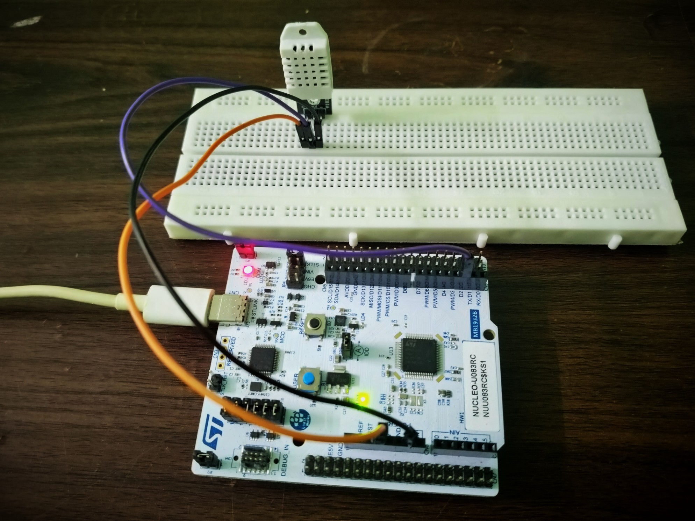
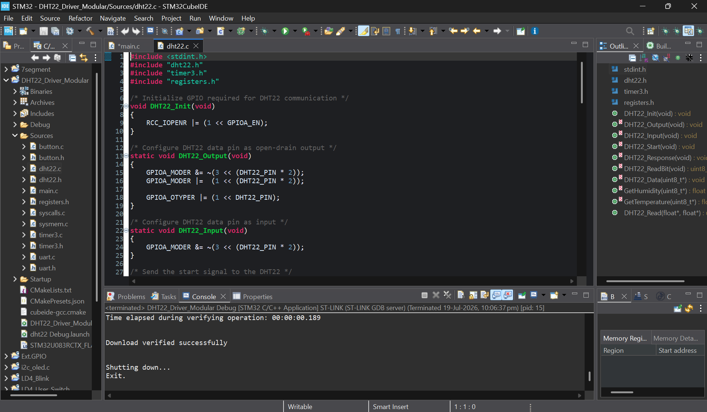
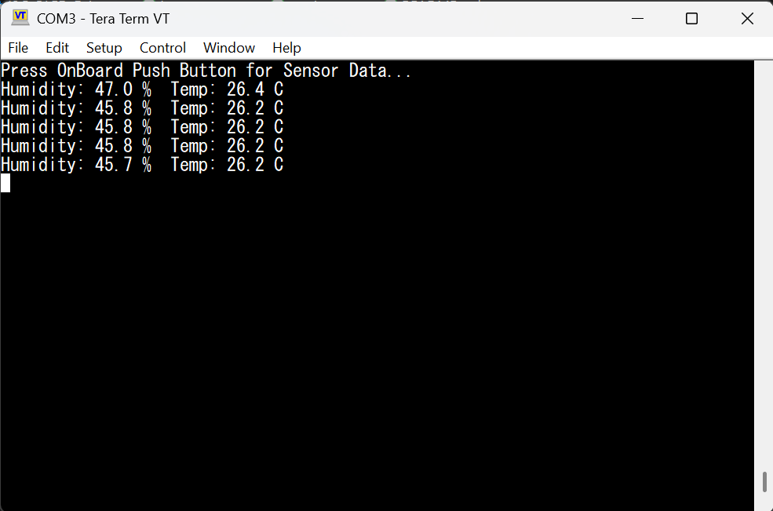

# TIM3_DHT22_UART

## Overview

This project demonstrates a **modular register-level DHT22 sensor driver implementation** on the **STM32 NUCLEO-U083RC** development board.

The firmware directly configures the **TIM3 peripheral** to generate precise microsecond delays required by the DHT22 communication protocol.

A custom DHT22 driver performs the complete sensor communication sequence, validates the received data using the checksum byte, and transmits the measured **temperature** and **humidity** over **USART2**.

All peripherals are configured using **direct register programming** without using the STM32 HAL library.

> **This project demonstrates the development of a custom DHT22 single-wire communication driver and its integration with TIM3 and UART using modular register-level programming.**

---

## Hardware Used

- STM32 NUCLEO-U083RC
- DHT22 (AM2302) Temperature and Humidity Sensor
- Breadboard
- Jumper Wires
- USB Type-C Cable

---

## Features

- Register-Level Programming
- Modular Driver Architecture
- Centralized Register Definitions
- TIM3 Microsecond Delay Driver
- GPIO Mode Switching (Input / Output)
- Open-Drain GPIO Configuration
- DHT22 Start Signal Generation
- DHT22 Response Detection
- Single-Wire Bit Reading
- 40-Bit Sensor Data Acquisition
- Checksum Validation
- Temperature Conversion
- Humidity Conversion
- Push Button Triggered Sensor Reading
- UART Output using USART2

---

# Project Images

## Hardware Setup



---

## STM32CubeIDE Project Structure



---

## UART Output



---

# Peripheral Configuration

| Configuration | Value |
|---------------|-------|
| Timer | TIM3 |
| Timer Resolution | 1 µs |
| Prescaler | 3 |
| Auto Reload Register | 65535 |
| UART Peripheral | USART2 |
| Baud Rate | 115200 |
| DHT22 Data Pin | PA10 |
| Push Button | PC13 |

---

# Hardware Connections

## DHT22 Sensor

| DHT22 Pin | STM32 Connection | Function |
|------------|------------------|----------|
| VCC | 3.3V | Sensor Power |
| DATA | PA10 | Data Line |
| GND | GND | Common Ground |

---

# DHT22 Driver Operation

The custom `DHT22_Read()` function performs a complete DHT22 communication sequence.

The communication sequence is:

```text
Generate Start Signal
        ↓
Wait for Sensor Response
        ↓
Read 40 Data Bits
        ↓
Store 5 Data Bytes
        ↓
Validate Checksum
        ↓
Convert Raw Humidity
        ↓
Convert Raw Temperature
        ↓
Return Measured Values
```

The driver validates the received packet by calculating the checksum.

```text
Byte0 + Byte1 + Byte2 + Byte3
                ↓
Least Significant Byte
                ↓
Compare with Byte4
```

If the checksum matches, the measured temperature and humidity are returned.

---

# DHT22 Data Format

The DHT22 transmits a total of **40 bits**.

| Byte | Description |
|------|-------------|
| Byte 0 | Humidity High Byte |
| Byte 1 | Humidity Low Byte |
| Byte 2 | Temperature High Byte |
| Byte 3 | Temperature Low Byte |
| Byte 4 | Checksum |

Humidity calculation:

```text
(Byte0 << 8) | Byte1
        ↓
Divide by 10
```

Temperature calculation:

```text
(Byte2 << 8) | Byte3
        ↓
Check Sign Bit
        ↓
Divide by 10
```

---

# Project Structure

```text
TIM3_DHT22_UART
├── Images/
│   ├── Hardware_Setup.jpg
│   ├── STM32CubeIDE_Build.png
│   └── TeraTerm_DHT22_Output.jpg
│
├── README.md
│
└── DHT22_Driver_Modular/
    ├── Sources/
    │   ├── main.c
    │   ├── registers.h
    │   ├── dht22.c
    │   ├── dht22.h
    │   ├── timer3.c
    │   ├── timer3.h
    │   ├── uart.c
    │   ├── uart.h
    │   ├── button.c
    │   └── button.h
    │
    └── Startup/
```

---

# Software Used

- STM32CubeIDE
- ARM GCC Toolchain
- Tera Term
- Git
- GitHub

---

# Notes

- Implemented entirely using direct register programming.
- No STM32 HAL library used.
- TIM3 is configured to generate precise microsecond delays.
- PA10 is configured as an open-drain GPIO for DHT22 communication.
- GPIO direction is switched between output and input during communication.
- Sensor data is validated using the checksum byte.
- Temperature and humidity are transmitted through USART2.
- PC13 onboard push button initiates each sensor measurement.
- Tested on the STM32 NUCLEO-U083RC development board.

---

# Future Improvements

- Interrupt-Based DHT22 Driver
- Communication Timeout Handling
- CRC/Error Statistics
- Continuous Periodic Sampling
- LCD/OLED Display Integration
- Multiple Sensor Support
- Data Logging
- Moving Average Filtering
- FreeRTOS Integration
- Low Power Operation