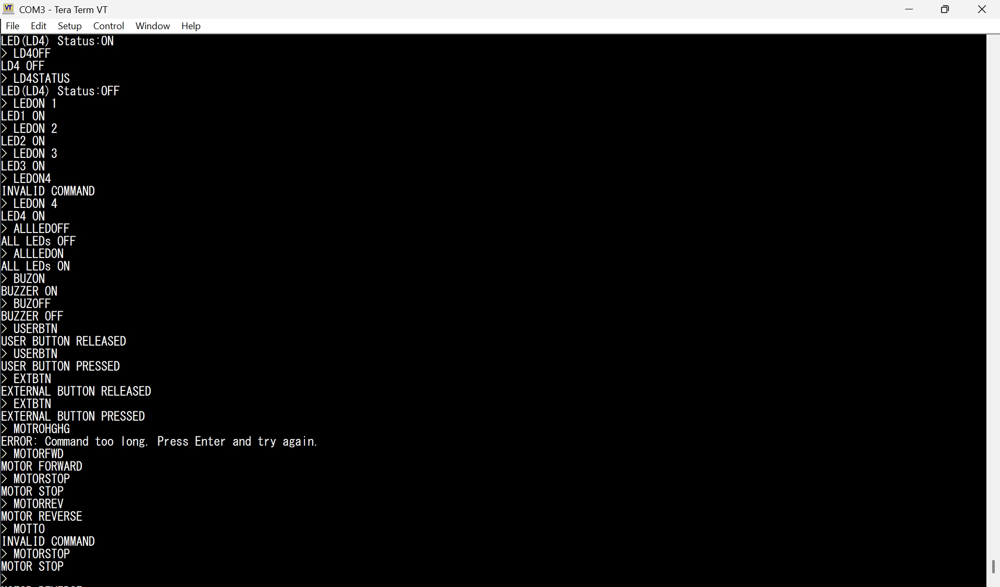

# UART_GPIO_MOTOR_v1

## Overview

This project demonstrates a **modular register-level firmware implementation** on the **STM32 NUCLEO-U083RC** development board.

The firmware provides a **UART-based Command-Line Interface (CLI)** for controlling LEDs, reading button status, controlling a buzzer, and operating a DC motor using an **L298N Motor Driver**.

All peripherals are configured using **direct register programming** without using the STM32 HAL library.

> **This project serves as the foundation for future register-level STM32 peripheral drivers such as I²C, Timers, PWM, ADC, and more.**

---

## Hardware Used

- STM32 NUCLEO-U083RC
- L298N Motor Driver
- DC Motor
- Active Buzzer Module
- 4 × External LEDs
- External Push Button
- Breadboard
- Jumper Wires
- 12V DC Adapter
- USB Type-C Cable

---

## Features

- Register-Level Programming
- Modular Driver Architecture
- Centralized Register Definitions
- UART Transmit
- UART Receive
- UART String Command Interface
- Case-Insensitive Command Parser
- On-board LD4 Control
- External LED Control
- LED Status
- User Button Status
- External Button Status
- Buzzer Control
- Motor Forward
- Motor Reverse
- Motor Stop
- Atomic GPIO Control using `GPIOx_BSRR`

---

# Project Images

## Hardware Setup


---

## UART Help Menu


---

## UART Command Interface



---

## Motor Control Demonstration


---

## STM32CubeIDE Project Structure


---

# UART Commands

| Command | Description |
|----------|-------------|
| `LD4ON` | Turn ON On-board LD4 |
| `LD4OFF` | Turn OFF On-board LD4 |
| `LD4STATUS` | Display LD4 Status |
| `LEDON n` | Turn ON External LED (1–4) |
| `LEDOFF n` | Turn OFF External LED (1–4) |
| `ALLLEDON` | Turn ON All External LEDs |
| `ALLLEDOFF` | Turn OFF All External LEDs |
| `BUZON` | Turn ON Buzzer |
| `BUZOFF` | Turn OFF Buzzer |
| `USERBTN` | Read On-board User Button |
| `EXTBTN` | Read External Button |
| `MOTORFWD` | Rotate Motor Forward |
| `MOTORREV` | Rotate Motor Reverse |
| `MOTORSTOP` | Stop Motor |
| `HELP` | Display Help Menu |

> **Commands are case-insensitive.**

---

# Hardware Connections

## LEDs

| STM32 Pin | Device |
|-----------|--------|
| PA5 | On-board LD4 |
| PA7 | External LED1 |
| PA8 | External LED2 |
| PA9 | External LED3 |
| PA10 | External LED4 |

---

## Buttons

| STM32 Pin | Device |
|-----------|--------|
| PC13 | On-board User Button |
| PA1 | External Push Button |

---

## Buzzer

| STM32 Pin | Device |
|-----------|--------|
| PA15 | Active Buzzer Module |

---

## Motor Driver (L298N)

| STM32 Pin | L298N Pin | Function |
|-----------|-----------|----------|
| PA4 | IN1 | Motor Direction Control |
| PA6 | IN2 | Motor Direction Control |
| GND | GND | Common Ground |

---

## Power Connections

| Supply | Connected To |
|--------|---------------|
| USB Type-C | STM32 NUCLEO-U083RC |
| +12V Adapter | L298N 12V Input |
| Adapter GND | L298N GND |
| STM32 GND | L298N GND |

> **Important:** The STM32 board and the L298N motor driver must share a common ground.

---

# Project Structure

```text
UART_GPIO_MOTOR_v1
├── Images/
│   ├── hardware_setup.jpg
│   ├── help_menu.png
│   ├── command_interface.png
│   ├── motor_control.png
│   └── cubeide_project.png
│
├── README.md
│
└── UART_Driver_Modular/
    ├── Sources/
    │   ├── main.c
    │   ├── registers.h
    │   ├── uart.c
    │   ├── uart.h
    │   ├── gpio.c
    │   ├── gpio.h
    │   ├── motor.c
    │   └── motor.h
    │
    └── Startup/
```

---

# Software Used

- STM32CubeIDE
- Tera Term
- Git
- GitHub

---

# Notes

- Implemented entirely using direct register programming.
- No STM32 HAL library used.
- USART2 is used through the ST-LINK Virtual COM Port.
- Modular source organization (`uart`, `gpio`, `motor`).
- GPIO outputs use the **GPIOx_BSRR** register for atomic Set/Reset operations.
- LED status is read using **GPIOx_ODR**.
- Tested on the STM32 NUCLEO-U083RC development board.

---

# Future Improvements

- Button-controlled peripheral operation
- Interrupt-driven UART reception
- PWM-based motor speed control
- Timer Driver
- SSD1306 OLED Driver (I²C)
- I²C EEPROM Driver
- DHT22 Sensor Driver
- Integrate multiple peripherals into a complete embedded application