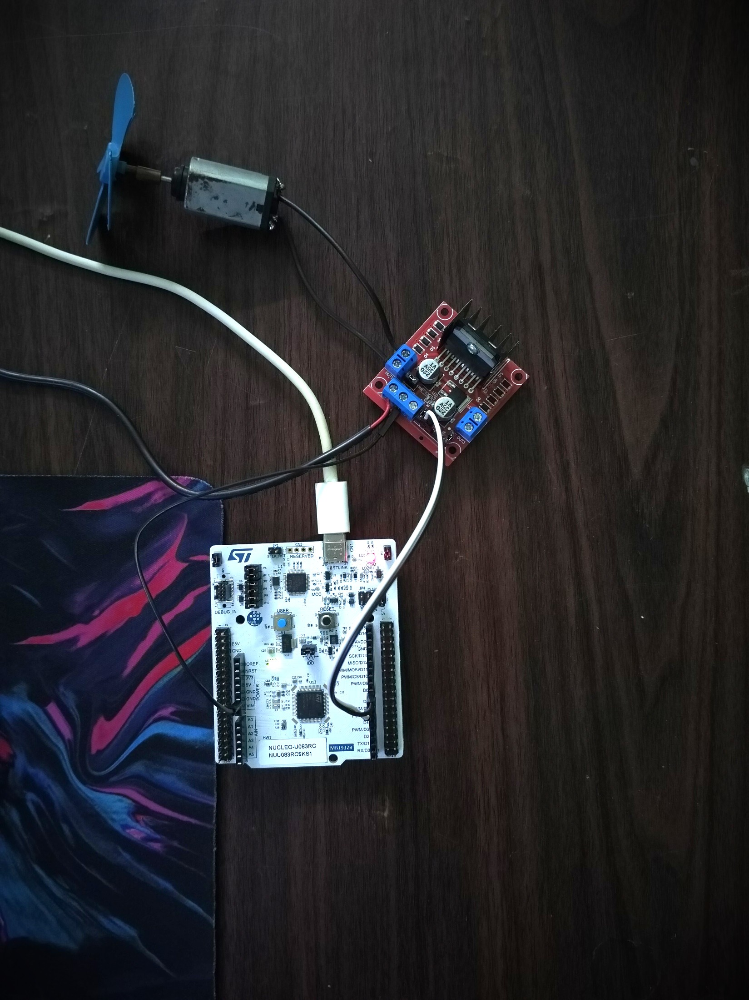
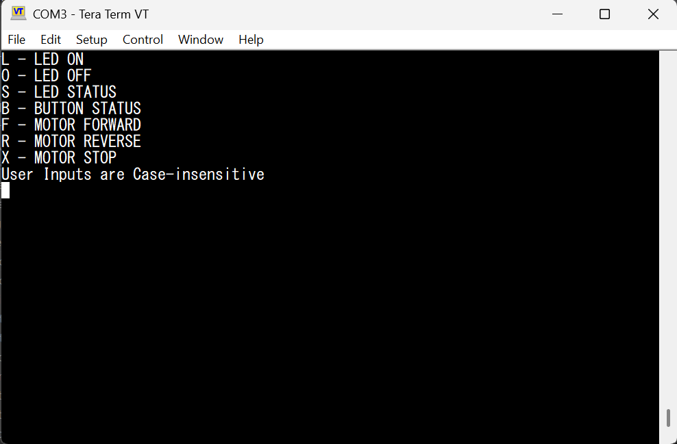
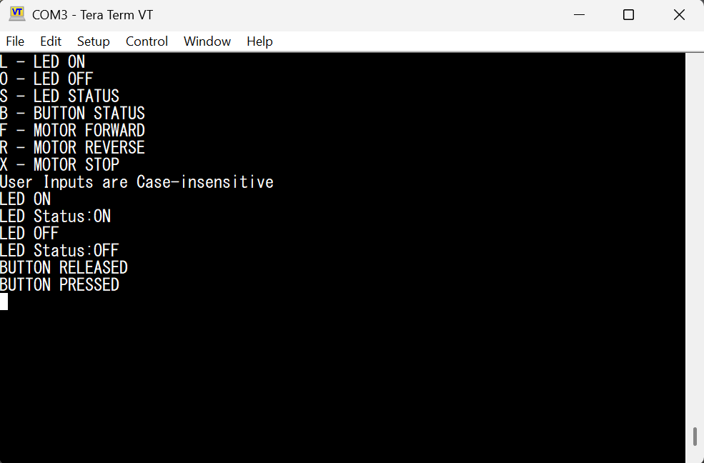
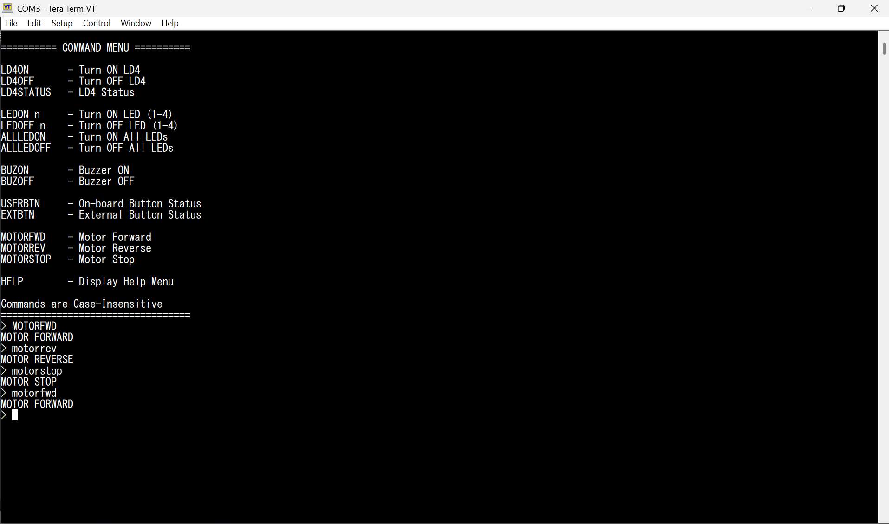
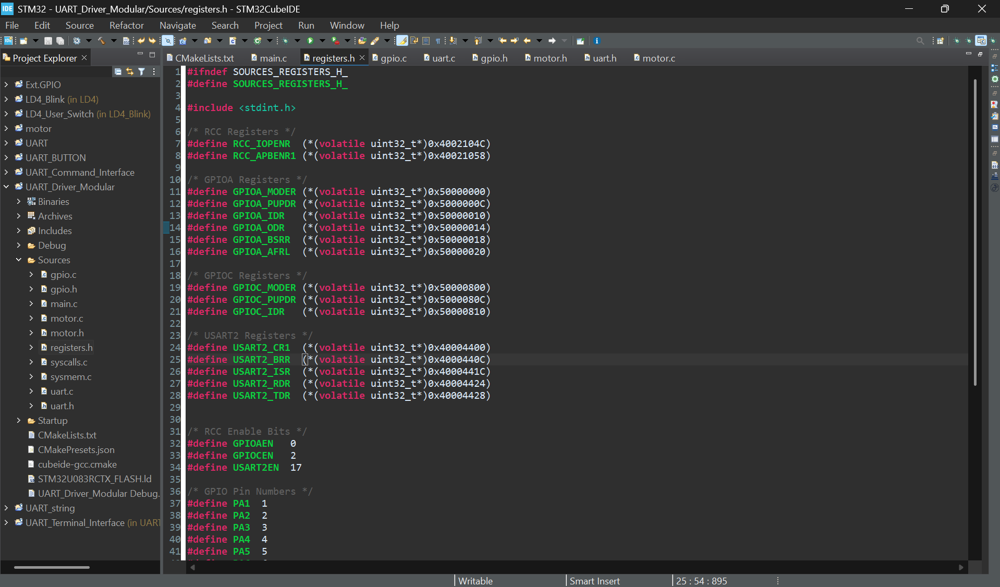

# UART_GPIO_MOTOR_v1

## Overview

This project demonstrates a **modular register-level firmware implementation** on the **STM32 NUCLEO-U083RC** development board.

The firmware provides a UART-based command-line interface to control the on-board LED, read the user button status, and control a DC motor through an **L298N motor driver**.

All peripheral configuration is implemented using **direct register programming** without the STM32 HAL library.

---

## Hardware Used

* STM32 NUCLEO-U083RC
* L298N Motor Driver
* DC Motor
* 12V DC Adapter
* USB Type-C (Programming & UART Terminal)

---

## Features

* Register-level programming
* Modular driver architecture
* UART Transmit
* UART Receive
* UART Command Interface
* LED ON/OFF Control
* LED Status
* User Button Status
* Motor Forward
* Motor Reverse
* Motor Stop

---

## Project Images

### Hardware Setup



---

### UART Help Menu



---

### LED and Button Demonstration



---

### Motor Control Demonstration



---

### STM32CubeIDE Project



---

## UART Commands

| Command | Function          |
| ------- | ----------------- |
| H       | Display Help Menu |
| L       | LED ON            |
| O       | LED OFF           |
| S       | LED Status        |
| B       | Button Status     |
| F       | Motor Forward     |
| R       | Motor Reverse     |
| X       | Motor Stop        |

> Commands are **case-insensitive**.

---

## Pin Connections

### STM32 → L298N

| STM32 Pin    | Function      | L298N Pin |
| ------------ | ------------- | --------- |
| CN9 D7 (PA8) | Motor Control | IN1       |
| CN9 D8 (PA9) | Motor Control | IN2       |
| GND          | Common Ground | GND       |

### External Power Supply

| Adapter | L298N |
| ------- | ----- |
| +12V    | 12V   |
| GND     | GND   |

> **Important:** The STM32 and the L298N must share a common ground.

---

## Project Structure

```text
UART_GPIO_MOTOR_v1
├── Images/
├── README.md
├── .gitignore
└── UART_Driver_Modular/
    ├── Sources/
    │   ├── main.c
    │   ├── uart.c / uart.h
    │   ├── gpio.c / gpio.h
    │   └── motor.c / motor.h
    └── Startup/
```

---

## Software Used

* STM32CubeIDE
* Tera Term
* Git
* GitHub

---

## Notes

* Register-level firmware implementation
* USART2 used for UART communication through the ST-LINK Virtual COM Port
* Modular driver organization (`uart`, `gpio`, `motor`)
* No STM32 HAL library used
* Tested on the STM32 NUCLEO-U083RC development board

---

## Future Improvements

* Centralize register definitions into a common header
* Improve code reuse and modularity
* Interrupt-driven UART reception
* PWM-based motor speed control
* SSD1306 OLED driver (I2C)
* I2C EEPROM support
* DHT22 sensor interface
* Combine peripherals into a complete embedded application
